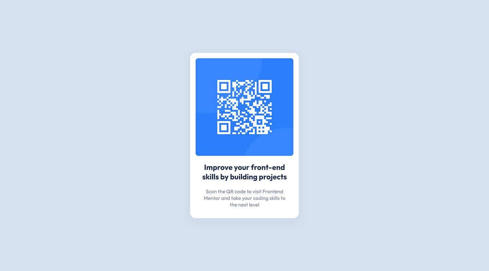

# Frontend Mentor - QR code component solution

This is a solution to the [QR code component challenge on Frontend Mentor](https://www.frontendmentor.io/challenges/qr-code-component-iux_sIO_H). Frontend Mentor challenges help you improve your coding skills by building realistic projects.

## Overview

### Screenshot

### Links

- Solution URL: [https://github.com/aneeshkr-me/qr-code-component](https://github.com/aneeshkr-me/qr-code-component)
- Live Site URL: [https://aneeshkr-me.github.io/qr-code-component](https://aneeshkr-me.github.io/qr-code-component)

## My process

- Semantic HTML5 markup
- CSS custom properties
- CSS Grid

## Author

- Website - [Aneesh Rajendran](https://aneeshkr.me)
- Frontend Mentor - [@aneeshkr-me](https://www.frontendmentor.io/profile/aneeshkr-me)
